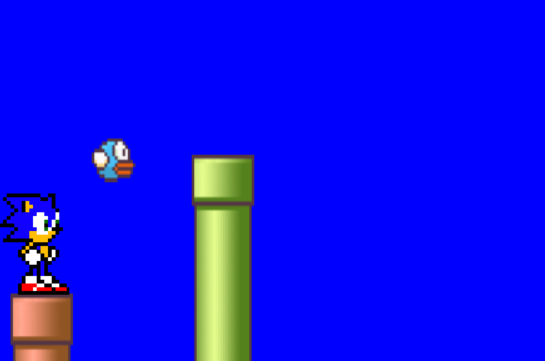
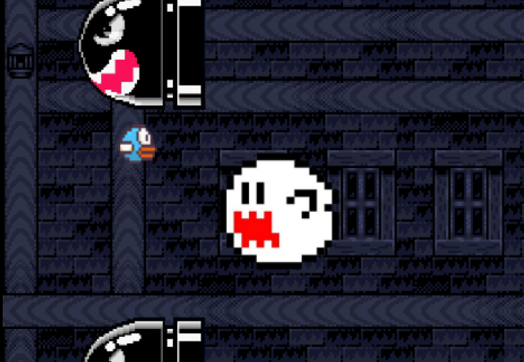

# 🎮 Flappy FEI

<p align="center">
<a href="#sobre">introducao📚</a>
<a href="#objetivo">como funciona?🎮</a>
<a href="#tecnologias">o que o projeto compreende?🛠️</a>
<a href="#estrutura">estrutura do projeto📸</a>
<a href="#futuro">atualizações📝</a>
<a href="#funcionalidades">funcionalidades do projeto🧠</a>
<a href="#creditos">Créditos</a>
</p>

## sobre



**Flappy FEI** é um jogo casual desenvolvido para navegadores web, inspirado na mecânica clássica do *Flappy Bird*. O jogador controla um pássaro que deve atravessar canos industriais sequenciais, exigindo precisão, reflexos rápidos e concentração para sobreviver o maior tempo possível.

O projeto foi desenvolvido com foco em simplicidade, desempenho e aprendizado prático de desenvolvimento front-end com tecnologias web.

---

## objetivo

O objetivo do Flappy FEI é manter o personagem em voo pelo maior tempo possível, desviando dos obstáculos ao longo do cenário. A cada obstáculo superado, é adicionado uma dificuldade para dinamizar a experiência. O jogo termina quando a quantidade de vida do personagem é esgotada, ocorrendo em encostar nos obstáculos, outros personagens ou limites do mapa. O jogo também apresenta opção para dois jogadores, semelhante ao modo comum do jogo inspiração flappy bird, sem movimentações usando o movimento do mouse

---


## tecnologias

- HTML5
- CSS3
- JavaScript (ES6+)

---

## estrutura

```bash
📁 jogoHTML-FEIcomputacao
├── 📁 ProjetoFull
│   ├── 📁 audio
│   ├── 📁 imagens
│   ├── 📁 testes
│   ├── 📄 Apresentação.html
│   ├── 🎨 estiloMenu.css
│   ├── ⚙️ mecanica.js
│   ├── 📄 menu.html
│   └── 🎨 visual.css
│
└── 📁 SobreJogo
    ├── 📄 desenvolvedores.html
    ├── 🎨 estilizar_desenvolvedores.css
    ├── 🎨 estilizar_pag_jogo.css
    ├── 🎨 estilizar_principal.css
    ├── 📄 pag_jogo.html
    ├── 📄 principal.html
    └── 📘 README.md
```

## Controles

- Clique do Mouse: faz o personagem subir
- Pressionar Enter faz a fase reiniciar
- Arrastar o mouse para esquerda e direita movimenta o personagem

---

## Como Executar

1. Baixe ou clone o projeto  
2. Abra o arquivo `menu.html` em um navegador moderno  

Nenhuma dependência externa é necessária.

---

## funcionalidades

- cronometro
- Detecção de colisão
- Animação contínua
- Opções com volume do som
- Opções de fases
- Alterações do cenário
- Chefes durante a progresão
- Músicas de jogos Retro
- Outros corpos(fases) em HTMLs
- Dificuldade progressiva
- Mais de um recurso de gameplay
- Opção de dois jogadores

---

## Licença

Projeto com fins educacionais.

---

## creditos

<a href="https://www.youtube.com/watch?v=LwS3_SRO2yQ">Street of rage boss theme</a><br>
<a href="https://www.youtube.com/watch?v=cDd_GlynA6A">Sonic the hedgehog Spring Yard zone theme</a>

Efeitos sonoros e Sprites:<br>
    Sonic the hedgehog<br>
    <a href="https://www.spriters-resource.com/custom_edited/sonicthehedgehogcustoms/">site para sprites sonic</a><br>
    Flappy Bird
    Imagens achadas em google fotos

---

## Autor

Desenvolvido por: Guilherme Silva Xavier